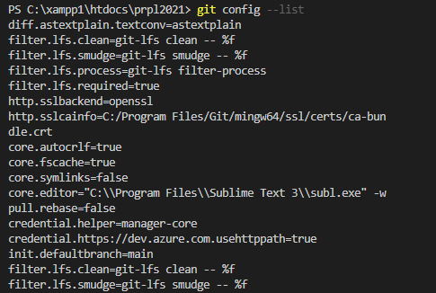

## Jawaban UTS Nomor 3
* git config --global user : perintah yang digunakan untuk mengkonfigurasi profil dari akun GitHub sehingga bisa diintegrasikan dengan VSC, username dan email yang dituliskan harus sesuai dengan username dan email yang digunakan pada account GitHub

* git config --list : perintah yang digunakan untuk melihat perintah - perintah dalam git serta konfigurasi yang dilakukan saat instalasi GitBash
)

* git log : perintah yang digunakan untuk menampilkan aktivitas - aktivitas yang dilakukan dalam github, seperti kapan terakhir melakukan commit, pull, request, dan hal lain yang berkaitan dengan github

* git status : perintah yang digunakan untuk menampilkan status tree dari work/repository/program yang sedang dibuat, apakah harus ada action commit ketika ada perubahan dari program yang sedang dikerjakan
* git pull origin nama_branch : perintah yang digunakan untuk merequest semua data yang ada pada repository dari branch tersebut, apakah data yang kita punyai sudah terupdate dengan repository pada github atau belum

* git show : fungsinya hampir sama seperti log, tapi pada perintah show ini ditampilkan data detail dari aktivitas yang dilakukan

* git commit –m “judul commit” : perintah yang digunakan untuk commit ke akun github, sehingga nantinya isi repository di github akan terupdate/tercommit

* git fetch origin : perintah untuk menampilkan semua object dari remote repository yang tidak berada di direktori kerja lokal

* git push -u origin nma_branch : perintah untuk mengirimkan perubahan ke master branch dari remote repository yang berhubungan dengan direktori yang digunakan

